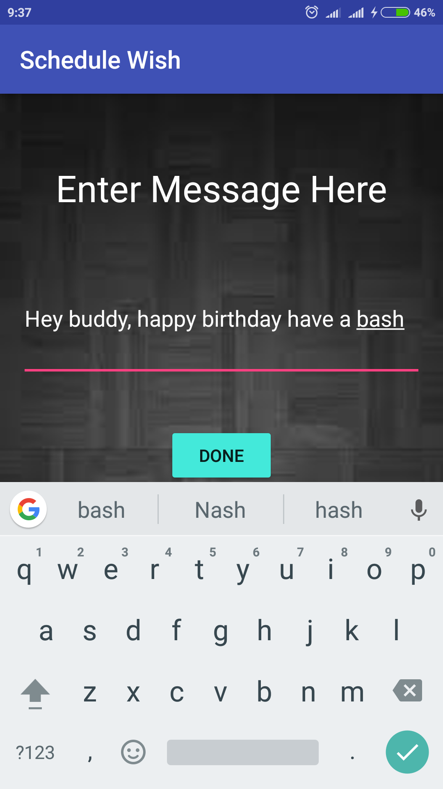

# Schedule Wish
Not to good with wishing birthdays on time or you tend to forget special days of someone important
too often, Schedule Wish comes to your rescue here.

Schedule Wish allows you to schedule sms wishes on specified dates to selected people.

Schedule Wish comes with simple and intutive UI and here is how you can use schedule wish:

- Open the app and press `Wish Karo` button.
{:height="192px" width="108px"}

- Select the category and press Add recipients.
{:height="192px" width="108px"}

- Select the contacts by marking the check boxes in front of the contact.
{:height="192px" width="108px"}

- Choose the date on which you want to send the sms, from the calendar.
{:height="192px" width="108px"}

- Now add the text message and press `Done`.
{:height="192px" width="108px"}

And Schedule Wish will send the message to selected contacts on specified date.

## How To Install

Just Download the Schedule Wish apk file and install in your android device.

## Tentaive Features

- Importing Events from Google Calendar.

- Special tags in message to allow user personalize group message by replacing tags with contact name.

- Template messages.

## License

Schedule Wish is released under GNU GENERAL PUBLIC LICENSE Version 3. Read about our License [here](https://github.com/khalibartan/Crammer-HITN17/blob/master/LICENSE)
  
